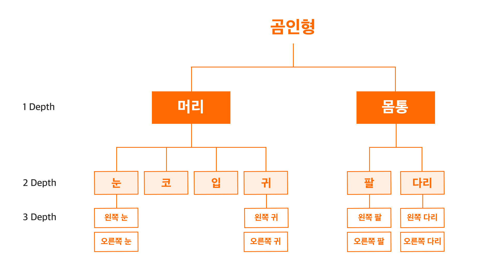

2-2. 협업을 위한 사전 준비: 2022 / 10 / 16

# Part2. 기획자의 일

---

## 2. 협업을 위한 사전 준비

기획자로서 가져야하는 협업의 자세를 보자. 전에는 기획자는 화면 그리기나 기능 구현이 아닌 방향성 설정과 유지를 보는 포지션이라고 배웠다. 그러므로 이번 목차엔 전체적인 틀을 짜는 기술을 서술했다. 서비스 전체 구조를 보는 IA를 웹사이트 구조에 기반해 구조화해 방향성을 구체적으로 설정한다. 근데 또 IA를 그리기위해 기능들을 구체적으로 리스트업해야하는데 MECE와 하이라키 기법이 있다.

- MECE: 맥킨지에서 개발한 기법, 목록화된 기능들을 유사한 성질끼리 묶어주는 역할을 함, 거창하게 기법어쩌구 했지만 경험적으로 체득한 사람도 많음
- 하이라키: 부모-자식 관계 등 상하 위계 구조를 의미, 디자인(UI/UX)에서 많이 쓰이는 계층 구조화의 일환으로 IA에 Depth(Level)로 같이 기획한다.

구현해야할 기능들을 일단 관찰하고 MECE로 비슷한 기능들을 모아 카테고리화하고 하이라키로 구현 중요도부터 기능들을 매겨 Depth로 나타낸다.
이렇게 기준을 나눠 유사한 기능을 모아둠과 동시에 세부적인 기능을 기획에 맞춰 IA를 짜서 방향성을 맞춘다.
